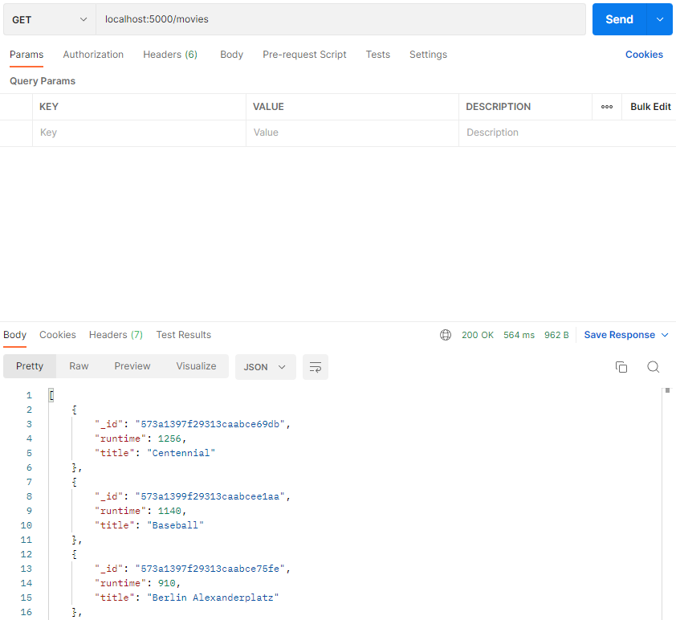
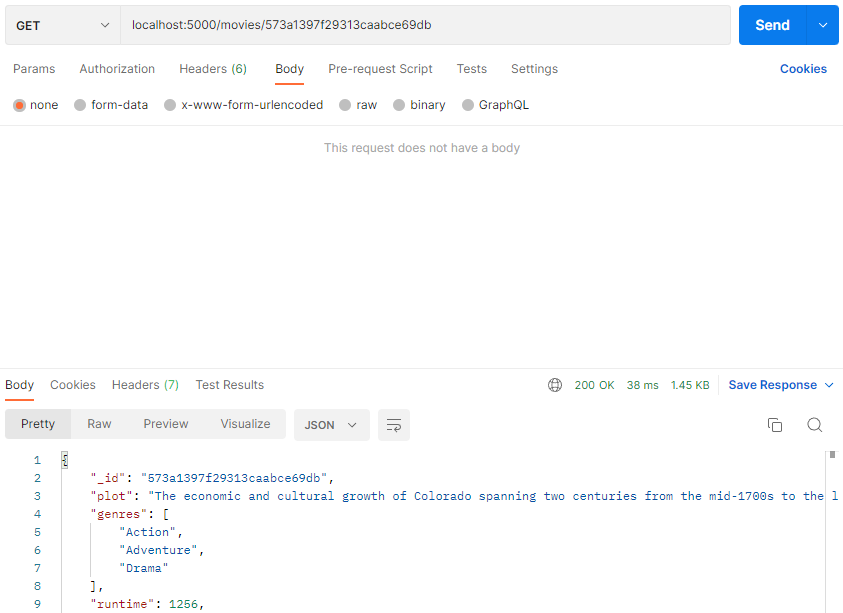
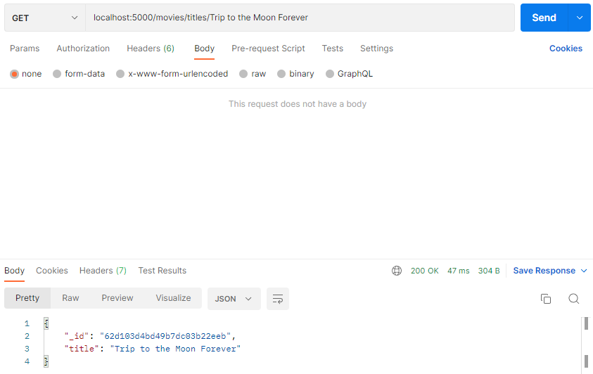
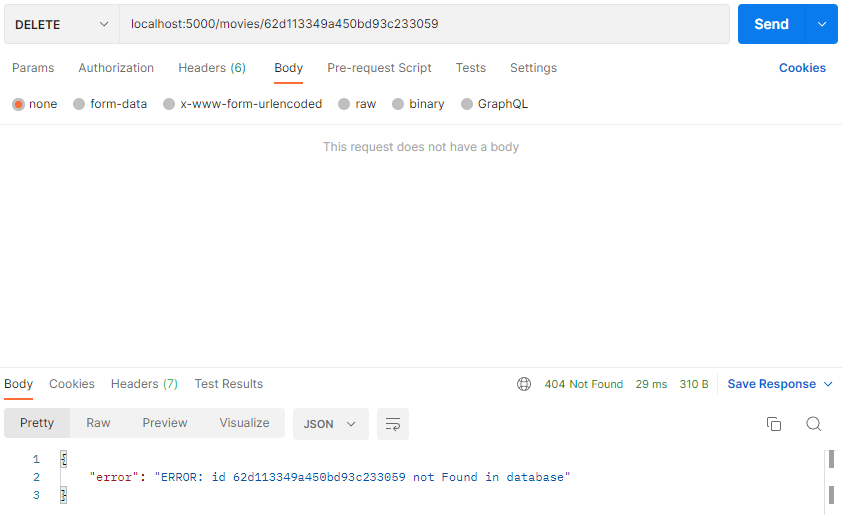
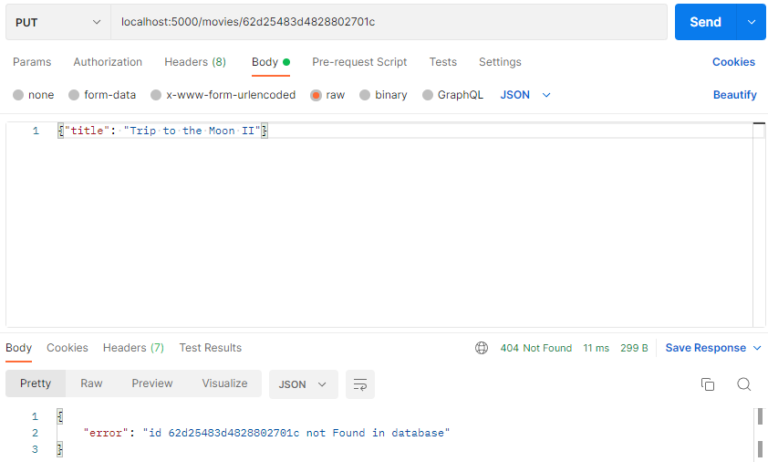
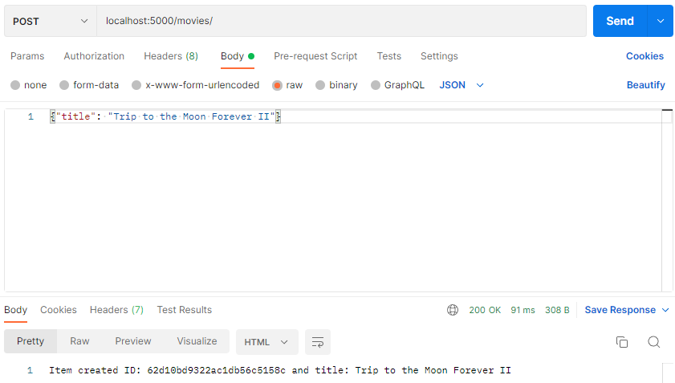

# Week 2 Homework Documentation

For this activity I used Postman for all http requests. Postman adds flexibility in the sense that the http requests can be saved in a collection for later use. Therefore, reducing testing time significantly in comparison to using curl commands. 

## getAll

getAll sorted by runtime:



### Sorting documents in MongoDB

In this example, I sort by runtime in descending order. Also, I include the title and runtime fields.

```ecmascript 6
    const database = client.db(databaseName)
    const movies = database.collection(collName)
    const query={}
    let movieCursor = await movies.find(query).limit(10).project({title:1, runtime:1}).sort({runtime:-1})
    return movieCursor.toArray()
```

## getById

getById success response



getById id not found in the database


### Get Request Error Handling

If the user enters an id with less than 24 characters, the app will throw an error. Therefore, an if block is needed to check for id length. 

```ecmascript 6

    if (movieId.length ===24){
        const query = {_id: ObjectId(movieId)}
        const result = await movies.findOne(query)
        if(result){
            return result
        } else{
        return {message: `ERROR: Title ${movieId} not Found in database`}
    }

    } else{

        return {message: `ERROR: id ${movieId} not Found in database`}
    }

```

Later I learned how to use try-catch blocks. Checking for length is not very elegant, so in a later example I use a try-catch block for a different http request.

## getByTitle

getByTitle success response



getByTitle title not found in the database


## deleteById

deleteById success response


deleteById Argument Error


deleteById id not found in database



### Delete Request Error Handling

If an id of less than 24 characters is input in the request, then the app will crash. Therefore, a try-catch block is needed to handle this kind of situations.
In the example below, the actual error message from express is displayed to the user in Postman. Code below is from routes/movies.js

```ecmascript 6
    try{
        const myData = await movieData.deleteById(req.params.id)
        res.status(200).send(myData.message)

    } catch(error){

        res.status(404).send({error: error.message})
    }
```


## updateById

updateById success response


updateById id not found in database



updateById nothing modified


### Put Request Error Handling

In this example, the title is being modified. If the user tries to modify a movie that does not exist, an error message will be displayed in postman. If the user does not actually change the title in the request body, then a message will be displayed in the response indicated nothing changed. If the modification is successful, it will be shown in the message.

In postman, in order to send a request body, you have to select body, raw, JSON and input the JSON request body in the text field.

```ecmascript 6

    const theMovie = await movieData.updateById(req.params.id, req.body)
    
    if (theMovie.modifiedCount===0){
        res.status(200).send({ message: "nothing modified" });
    } else if (theMovie.modifiedCount===1){
        res.status(200).send({message: `document with id: ${req.params.id} successfully modified`})
    } else{
        res.status(404).send({ error: theMovie.message });
    }
```

## create

create success response



create duplicate key error


### Post Request Error Handling

If the user tries to create a document with an existing id, the app will crash. Therefor, an if block is needed to check if an id already exists.
In the example below, a custom error message is displayed to the user in Postman. 

In postman, in order to send a request body, you have to select body, raw, JSON and input the JSON request body in the text field.

```ecmascript 6

    if(!movieID){

        const result = await movies.insertOne(newObj)
        const id = result.insertedId

        if(result.acknowledged){
            return {newObjectId: id, message: `Item created ID: ${id} and title: ${newObj.title}`}

        } else {
            return {message: `ERROR: Unable to insert ${newObj.title} into database`}
        }

    } else{
        return {message: `ID: ${newObj._id} already exists. Unable to create a duplicate`}
    }

```

### Tech used

1. Postman
2. nodemon


